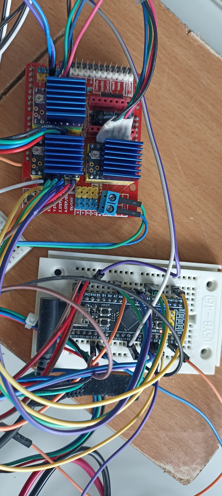

.. _boards:

Boards
======

A Marriage of Convenience: Blackpill STM32F411CE + CNC Header Board
--------------------------------------------------------------------

Introduction
~~~~~~~~~~~~

This document describes the hybrid "Boards" setup created by combining a low-cost **Blackpill STM32F411CE** development board with a custom **CNC header board**. 

The result is a compact, powerful, and inexpensive motion control solution suitable for small CNC machines, 3D printers, laser cutters, or other stepper/servo-based projects.

Why This Combination?
~~~~~~~~~~~~~~~~~~~~~

- **Blackpill STM32F411CE**
   - Extremely cheap (~$5–8)
   - Powerful ARM Cortex-M4 @ 100 MHz with FPU
   - 512 KB Flash, 128 KB RAM
   - Excellent USB, SPI, I2C, UART, timers, and ADC peripherals
   - Small form factor

- **CNC Header Board**
   - Breaks out all necessary signals for CNC control
   - Standard stepper driver interfaces (STEP/DIR/ENABLE)
   - Endstop / probe / spindle / coolant outputs
   - Power distribution and protection
   - Optional SD card slot, display connector, etc.

Together they create a clean, reliable stack that avoids the limitations of "all-in-one" CNC boards while keeping costs very low.

Physical Integration
~~~~~~~~~~~~~~~~~~~~

The CNC header board is designed to sit directly on top of (or under) the Blackpill using header pins, creating a sandwich-style assembly. Key features of the integration:

- Direct GPIO mapping from STM32F411 to CNC functions
- Proper power routing (3.3V logic + 5V tolerant inputs where needed)
- Mechanical stability with mounting holes
- Clear silkscreen labeling

.. note::
   The Blackpill is mounted **component side up** with the USB connector accessible on one end.

Pin Mapping (Example)
~~~~~~~~~~~~~~~~~~~~~

.. list-table:: Typical CNC Signal Mapping
   :header-rows: 1
   :widths: 30 40 30

   * - CNC Function
     - STM32 Pin
     - Notes
   * - X_STEP
     - PA8
     - TIM1 channel
   * - X_DIR
     - PA9
     - 
   * - Y_STEP
     - PA10
     - 
   * - Z_STEP
     - PB6
     - 
   * - E0_STEP
     - PB7
     - Extruder or 4th axis
   * - Endstops
     - PC13, PC14, PC15
     - Pull-ups enabled
   * - Spindle PWM
     - PA0
     - TIM2/5
   * - SD Card
     - SPI1 (PA4-PA7)
     - Optional

Firmware Support
~~~~~~~~~~~~~~~~

This board combination works well with:

- **FluidNC** (recommended for CNC)
- **GRBL-STM32** port
- **Klipper** (via custom config)
- Custom firmware using **libopencm3** or **STM32Cube**

Advantages
~~~~~~~~~~

- Very low total cost
- High performance (100 MHz + hardware timers)
- Excellent real-time capabilities
- Easy to repair / replace individual parts
- Full control over pinout and features

.. tip::
   Add a small heatsink on the STM32F411 for sustained high-speed stepper pulsing.

Files
~~~~~

- ``hardware/blackpill_cnc_v1.sch`` — KiCad schematic
- ``hardware/blackpill_cnc_v1.kicad_pcb`` — Layout
- ``firmware/fluidnc_config.yaml`` — Sample config

See Also
~~~~~~~~

- :doc:`blackpill-specs`
- :doc:`cnc-header-details`
- :doc:`assembly-guide`

