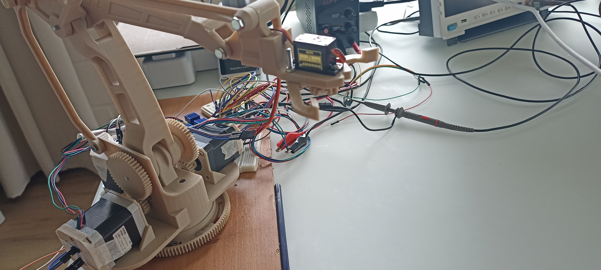

.. _encoder:

Encoder
=======

Closed-Loop Feedback with AS5600 Magnetic Encoder
-------------------------------------------------

Why Use a Cheap AS5600 on the Back of a NEMA Stepper?
~~~~~~~~~~~~~~~~~~~~~~~~~~~~~~~~~~~~~~~~~~~~~~~~~~~~~~

To add reliable closed-loop position feedback at very low cost, I mounted an **AS5600** magnetic encoder on the rear shaft of standard NEMA17 and NEMA23 stepper motors.

`View full resolution image <images/encoder.jpg>`_

Rationale for Choosing the AS5600
~~~~~~~~~~~~~~~~~~~~~~~~~~~~~~~~~

**Key Advantages:**

- Very low cost ($1.5 – $3)
- 12-bit resolution (4096 counts per revolution)
- Contactless magnetic sensing (no wear)
- Easy I²C interface
- Small neodymium magnet (usually 10mm × 2–3mm) attached directly to the motor shaft
- Good performance for the price

**Mounting Method**

A small diametric magnet is glued or press-fit onto the rear shaft of the stepper. The AS5600 breakout board is held in place by a custom 3D-printed bracket, maintaining an air gap of approximately 1–2 mm.

Comparison Table
~~~~~~~~~~~~~~~~

.. list-table:: Encoder Options Comparison
   :header-rows: 1
   :widths: 30 20 20 30

   * - Type
     - Resolution
     - Cost
     - Verdict
   * - AS5600 Magnetic
     - 12-bit
     - Very Low
     - **Best choice for this project**
   * - Optical Encoder
     - 600–2000 PPR
     - Medium
     - More fragile and alignment-sensitive
   * - AS5047 / TLV493D
     - 14-bit+
     - Higher
     - Overkill for most builds

Benefits of Rear-Shaft Mounting
~~~~~~~~~~~~~~~~~~~~~~~~~~~~~~~

- Does not interfere with the front shaft or load
- Uses standard stepper motors without modification
- Easy access for wiring and maintenance
- Keeps the encoder relatively protected

Limitations
~~~~~~~~~~~

- 12-bit resolution is sufficient for most CNC and robotics applications
- Should be kept away from strong external magnetic fields
- Requires a rigid and well-aligned mounting bracket

Firmware Compatibility
~~~~~~~~~~~~~~~~~~~~~~

- **FluidNC** (recommended)
- **Klipper**
- Custom STM32 firmware

**Typical Wiring to STM32F411 Blackpill:**

- VCC → 3.3V
- GND → GND
- SDA → PB9
- SCL → PB8

See Also
~~~~~~~~

- :doc:`boards` — Blackpill + CNC Header Board
- :doc:`closed-loop-control`
- :doc:`as5600-mounting-bracket`

