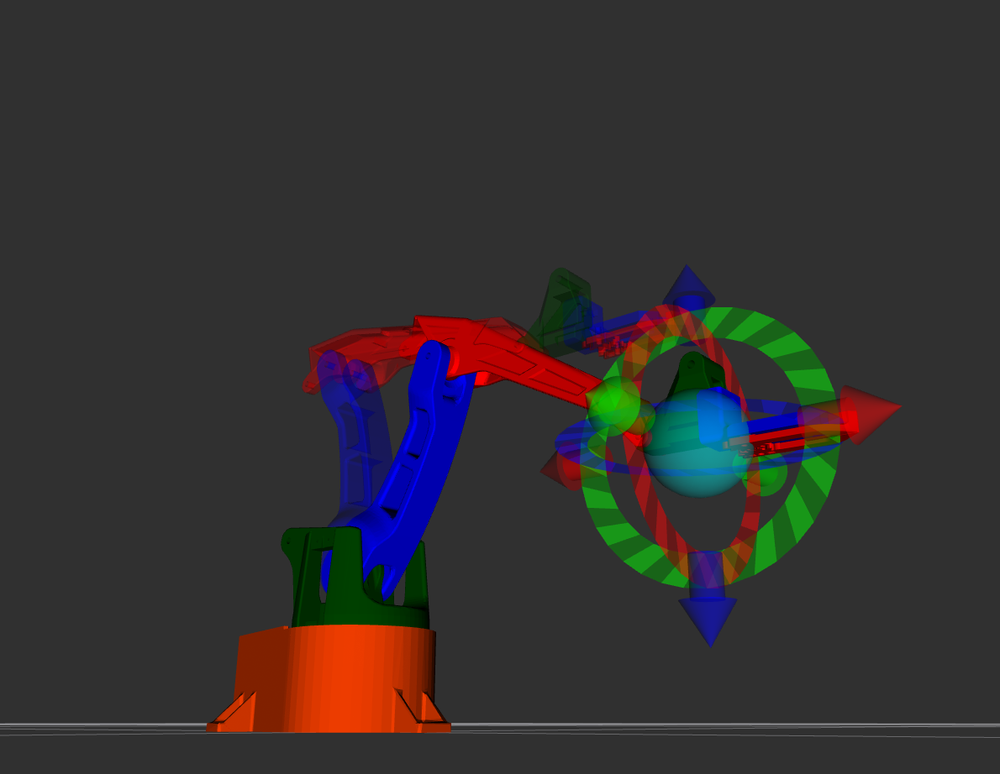

RViz2 Motion Planning
=====================

To use the Motion Planning plugin in RViz2 for your robot, you need to properly set up your URDF and launch environment. Here is a complete guide based on your setup.

Setup Overview
--------------

You have placed all ROS 2 definitions (URDF, SRDF, kinematics, etc.) inside a folder called ``my_urdf_folder``, which is located in your project directory.

You are using the official MoveIt 2 Docker image:

- **Image**: ``docker.io/moveit/moveit2:jazzy-release``

Launching the Container
-----------------------

Because you need graphical capabilities (RViz2), the container must be launched with specific flags to enable display forwarding and proper permissions.

Here is the command you are using:

.. code-block:: bash

   podman run -it --rm \
     --net=host \
     --ipc=host \
     --privileged \
     -e DISPLAY=$DISPLAY \
     -e QT_X11_NO_MITSHM=1 \
     -v /tmp/.X11-unix:/tmp/.X11-unix:rw \
     -v /usr/src/microros_stm32/my_urdf_folder:/urdf \
     -v $XAUTHORITY:/root/.Xauthority \
     docker.io/moveit/moveit2:jazzy-release \
     bash

Command Flags Explanation
~~~~~~~~~~~~~~~~~~~~~~~~~

- ``-it``: Run the container interactively with a pseudo-TTY.
- ``--rm``: Automatically remove the container when it exits.
- ``--net=host``: Use the host's network stack (important for ROS 2 communication).
- ``--ipc=host``: Share the host's IPC namespace (needed for shared memory in ROS 2).
- ``--privileged``: Give the container extended privileges (often required for graphics and device access).
- ``-e DISPLAY=$DISPLAY``: Pass the host's display environment variable to enable GUI forwarding.
- ``-e QT_X11_NO_MITSHM=1``: Disable MIT-SHM extension (fixes common Qt/X11 issues inside containers).
- ``-v /tmp/.X11-unix:/tmp/.X11-unix:rw``: Mount the X11 socket for graphical output.
- ``-v /usr/src/microros_stm32/my_urdf_folder:/urdf``: Mount your URDF folder into the container at ``/urdf``.
- ``-v $XAUTHORITY:/root/.Xauthority``: Mount X11 authentication file (required for GUI access).
- ``docker.io/moveit/moveit2:jazzy-release``: The MoveIt 2 Jazzy image.

Setting Up the Environment Inside the Container
-----------------------------------------------

After entering the container, source your workspace:

.. code-block:: bash

   source /urdf/install/setup.bash

Launching RViz2 with Motion Planning
------------------------------------

You can now launch your robot visualization and motion planning interface with:

.. code-block:: bash

   ros2 launch easy demo.launch.py

This command should open RViz2 with the MoveIt Motion Planning plugin loaded, allowing you to drag the interactive end-effector marker to plan motions.

Next Steps
----------

Once RViz2 is running:
- Select the **Interact** tool.
- Drag the orange interactive marker on the end-effector.
- Use the **Motion Planning** panel to plan and execute trajectories.
