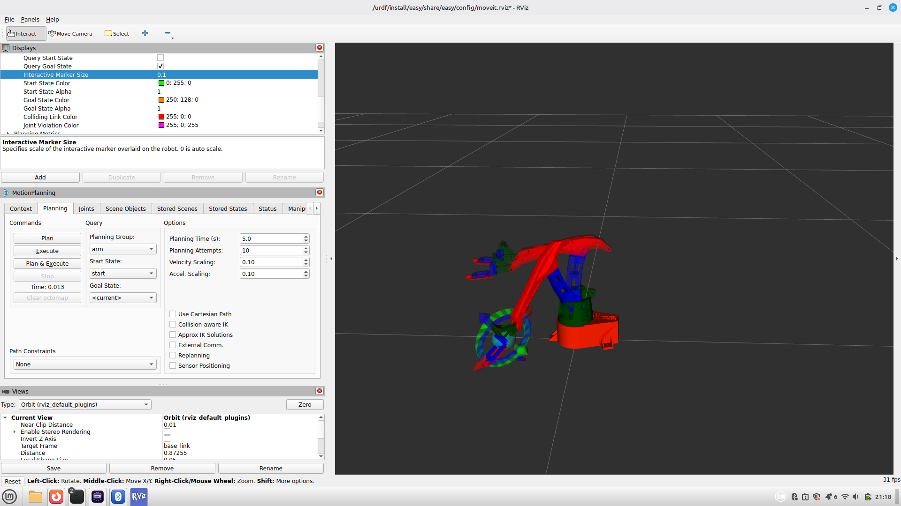
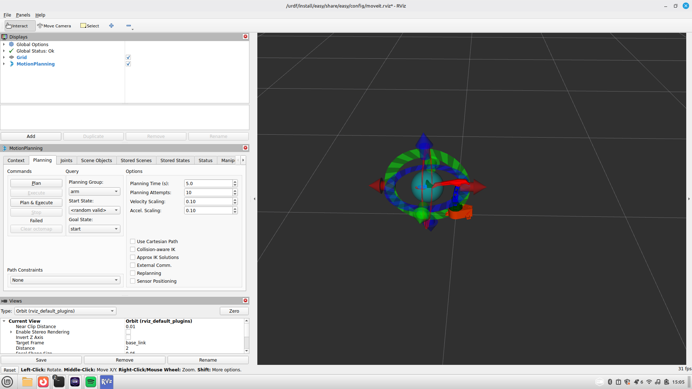
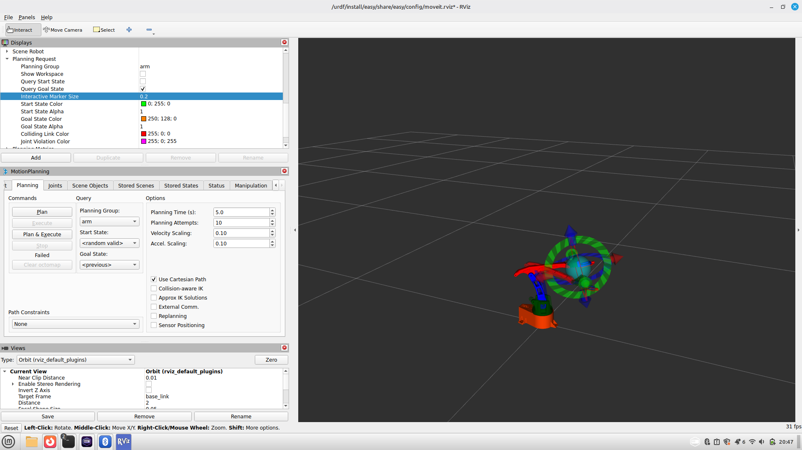

RViz2 some printscreens
=======================

Here a some print screens, to inspire some settings made in the rviz2 graphical enviroment.
It is highly customable, you can change the size of the end_effector, .... 

Setup Overview
--------------

